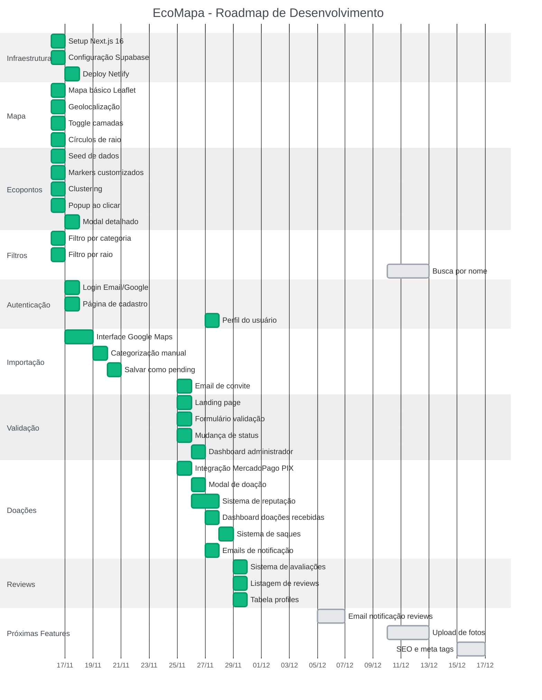

# EcoMapa - Product Backlog

## 🎯 Legenda

**Prioridade:**
- 🔴 P0 - Must Have (MVP)
- 🟡 P1 - Should Have (MVP)
- 🟢 P2 - Could Have (Pós-MVP)

**Complexidade:**
- S (Small) - 1-2 dias
- M (Medium) - 3-5 dias
- L (Large) - 1-2 semanas
- XL (Extra Large) - 2+ semanas

---

## ÉPICO 1: Setup e Infraestrutura

### 📦 [P0-INFRA-001] Setup inicial do projeto Next.js
**Complexidade:** S

**Como** desenvolvedor  
**Quero** ter o ambiente base configurado  
**Para** iniciar o desenvolvimento do EcoMapa

**Critérios de Aceitação:**
- [x] Projeto Next.js 14+ com App Router inicializado
- [x] TailwindCSS configurado e funcionando
- [x] ESLint + Prettier configurados
- [x] TypeScript strict mode habilitado
- [x] Estrutura de pastas criada (app/, components/, lib/)
- [x] Git repository inicializado com .gitignore adequado
- [ ] README.md básico com instruções de setup

**Definição de Pronto:**
- [x] `npm run dev` roda sem erros
- [x] Hot reload funcionando
- [ ] Build de produção bem-sucedida

---

### 📦 [P0-INFRA-002] Configuração Supabase
**Complexidade:** M  
**Dependências:** INFRA-001

**Como** desenvolvedor  
**Quero** ter o Supabase configurado com schema inicial  
**Para** armazenar dados dos ecopontos

**Critérios de Aceitação:**
- [x] Projeto Supabase criado (free tier)
- [x] Extensão PostGIS habilitada no banco
- [x] Schema inicial criado (migrations):
  - Tabelas: ecopoints, categories, donations, reviews, user_reputation
  - Índices geoespaciais em ecopoints.location
  - Foreign keys e constraints configurados
- [x] RLS (Row Level Security) configurado:
  - ecopoints: leitura pública, escrita owner
  - reviews: leitura pública, escrita autenticado
  - donations: leitura owner/admin
- [x] Variáveis de ambiente (.env.local) configuradas
- [x] Cliente Supabase instanciado em lib/supabase/client.ts
- [ ] Tipagem TypeScript gerada do schema

**Definição de Pronto:**
- [x] Conexão com banco funciona
- [x] Query simples retorna dados
- [ ] RLS bloqueia acessos não autorizados

---

### 📦 [P0-INFRA-003] Deploy Netlify
**Complexidade:** S
**Dependências:** INFRA-001, INFRA-002

**Como** desenvolvedor
**Quero** ter deploy automático funcionando
**Para** testar em produção desde cedo

**Critérios de Aceitação:**
- [x] Projeto conectado ao Netlify
- [x] Build settings configurados para Next.js
- [x] Variáveis de ambiente configuradas no Netlify
- [x] Deploy automático no push para main
- [x] Preview deploys em PRs funcionando
- [x] Custom domain configurado (ou Netlify domain)
- [x] HTTPS funcionando

**Definição de Pronto:**
- [x] Site acessível publicamente
- [x] Build passa sem erros
- [x] Variáveis de ambiente carregando corretamente

**Configuração Netlify:**
```
netlify.toml criado com:
- Build command: npm run build
- Publish: .next
- Node 20
- Plugin: @netlify/plugin-nextjs

Variáveis de ambiente necessárias no Netlify Dashboard:
- NEXT_PUBLIC_SUPABASE_URL
- NEXT_PUBLIC_SUPABASE_ANON_KEY
```

---

## ÉPICO 2: Visualização de Mapa

### 🗺️ [P0-MAP-001] Componente de mapa básico com Leaflet
**Complexidade:** M  
**Dependências:** INFRA-001

**Como** usuário anônimo  
**Quero** ver um mapa interativo do Brasil  
**Para** explorar iniciativas regenerativas

**Critérios de Aceitação:**
- [x] Leaflet e react-leaflet instalados
- [x] MapContainer component criado e renderizando
- [x] Camada base OpenStreetMap carregando
- [x] Mapa centralizado no Brasil (lat: -15.7801, lng: -47.9292)
- [x] Zoom inicial em 4 (visão país inteiro)
- [x] Controles de zoom funcionando
- [x] Pan (arrastar mapa) funcionando
- [x] Mapa responsivo (mobile e desktop)
- [x] Loading state durante carregamento dos tiles

**Definição de Pronto:**
- [x] Mapa visível sem console errors
- [x] Interações funcionando suavemente
- [x] Performance aceitável em mobile (< 3s load)

---

### 🗺️ [P0-MAP-002] Geolocalização do usuário
**Complexidade:** S  
**Dependências:** MAP-001

**Como** usuário  
**Quero** que o mapa centralize na minha localização  
**Para** ver ecopontos perto de mim

**Critérios de Aceitação:**
- [x] Browser Geolocation API implementada
- [x] Botão "Minha Localização" visível no mapa
- [x] Ao clicar, solicita permissão de localização
- [x] Se permitido: centraliza mapa na localização atual
- [x] Se negado: mostra mensagem e usa fallback (São Paulo centro)
- [x] Marcador azul indica posição do usuário
- [x] Círculo semi-transparente ao redor (precisão ~100m)
- [x] Loading state durante obtenção da localização
- [x] Timeout de 10s (fallback se demorar muito)

**Definição de Pronto:**
- [x] Geolocalização funciona em Chrome, Firefox, Safari
- [ ] Funciona em mobile (iOS e Android)
- [x] Erros tratados com mensagens amigáveis
- [x] Não trava se permissão negada

---

### 🗺️ [P0-MAP-003] Toggle camadas (Ruas/Satélite)
**Complexidade:** S  
**Dependências:** MAP-001

**Como** usuário  
**Quero** alternar entre visão de ruas e satélite  
**Para** ter diferentes perspectivas do território

**Critérios de Aceitação:**
- [x] Componente LayerToggle criado
- [x] Botão toggle posicionado (canto superior direito)
- [x] Duas opções: "Ruas" e "Satélite"
- [x] Camada Ruas: OpenStreetMap tiles
- [x] Camada Satélite: Esri WorldImagery ou similar (free)
- [ ] Transição suave entre camadas (fade)
- [x] Estado da camada persiste durante a sessão
- [x] Ícones visuais para cada opção (🗺️ / 🛰️)

**Definição de Pronto:**
- [x] Toggle funciona sem reload da página
- [x] Ambas camadas carregam corretamente
- [x] Performance não degrada ao trocar
- [ ] Funciona em mobile

---

### 🗺️ [P0-MAP-004] Círculos de raio de busca
**Complexidade:** S  
**Dependências:** MAP-002

**Como** usuário  
**Quero** ver círculos de 1km, 2km e 5km da minha posição  
**Para** entender a distância dos ecopontos

**Critérios de Aceitação:**
- [x] Componente RadiusCircle criado
- [x] Três círculos concêntricos ao redor do usuário:
  - 1km (verde claro, opacity 0.1)
  - 2km (verde médio, opacity 0.08)
  - 5km (verde escuro, opacity 0.05)
- [x] Bordas dos círculos com stroke sutil
- [ ] Labels mostrando "1km", "2km", "5km" (removido por solicitação)
- [x] Círculos se movem ao reposicionar usuário
- [x] Toggle para mostrar/esconder círculos
- [x] Não interferem com interação do mapa

**Definição de Pronto:**
- [x] Círculos visíveis mas não intrusivos
- [x] Escala correta (verificar com Google Maps)
- [x] Performance OK (não lag ao arrastar)

---

## ÉPICO 3: Visualização de Ecopontos

### 📍 [P0-POINT-001] Seed de dados iniciais
**Complexidade:** M  
**Dependências:** INFRA-002

**Como** desenvolvedor  
**Quero** ter dados de exemplo no banco  
**Para** testar a visualização de ecopontos

**Critérios de Aceitação:**
- [x] Script seed.ts criado (SQL seed file)
- [x] Tabela categories populada com 8 categorias:
  - 🥕 Alimentação regenerativa
  - 🛍️ Consumo consciente
  - 🔄 Economia circular
  - 🌳 Natureza e biodiversidade
  - 🌱 Agroecologia urbana
  - 🤝 Comunidades e coletivos
  - 🛠️ Oficinas e aprendizado
  - 🏢 ONGs e organizações
- [x] Mínimo 20 ecopontos cadastrados (SP + RJ + BH)
- [x] Dados realistas: nome, descrição, lat/lng, categoria
- [x] Mix de status: validated (70%), pending (30%)
- [ ] Alguns com reviews e ratings
- [ ] Script rodável via `npm run seed`

**Definição de Pronto:**
- [x] Query retorna 20+ ecopontos
- [x] Dados geograficamente distribuídos
- [x] Categorias balanceadas

---

### 📍 [P0-POINT-002] Markers customizados por categoria
**Complexidade:** M  
**Dependências:** POINT-001, MAP-001

**Como** usuário  
**Quero** ver pins no mapa com ícones de categoria  
**Para** identificar rapidamente o tipo de ecoponto

**Critérios de Aceitação:**
- [x] Componente EcopointMarker criado
- [x] Query busca ecopontos em viewport atual
- [x] Markers renderizados com emoji da categoria
- [x] Tamanho do marker: 40x40px
- [x] Background circular colorido (cor da categoria)
- [x] Emoji centralizado no marker
- [x] Markers clicáveis (cursor pointer)
- [x] Hover effect (scale 1.1)
- [x] Z-index correto (não sobrepõem incorretamente)

**Definição de Pronto:**
- [x] Todos os 20+ pontos visíveis no mapa
- [x] Emojis renderizando corretamente
- [x] Performance OK com 50+ markers

---

### 📍 [P0-POINT-003] Clustering de markers
**Complexidade:** M  
**Dependências:** POINT-002

**Como** usuário  
**Quero** que markers próximos se agrupem  
**Para** não sobrecarregar o mapa visualmente

**Critérios de Aceitação:**
- [x] Leaflet.markercluster instalado
- [x] Markers agrupam quando próximos (< 80px)
- [x] Cluster mostra número de pontos
- [ ] Cluster colorido por categoria predominante
- [x] Ao clicar cluster: zoom in para expandir
- [x] Zoom suficiente: mostra markers individuais
- [x] Animação suave ao agrupar/desagrupar
- [x] Performance OK com 100+ markers

**Definição de Pronto:**
- [x] Clustering funciona em todos zoom levels
- [x] Smooth UX ao interagir
- [ ] Mobile friendly

---

### 📍 [P0-POINT-004] Popup ao clicar em marker
**Complexidade:** S  
**Dependências:** POINT-002

**Como** usuário  
**Quero** ver informações resumidas ao clicar em um pin  
**Para** decidir se quero saber mais

**Critérios de Aceitação:**
- [x] Popup Leaflet customizado
- [x] Exibe:
  - Nome do ecoponto
  - Categoria (emoji + texto)
  - Rating (estrelas) se disponível
  - Descrição curta (max 100 caracteres)
  - Badge "Validado" se status validated
  - Botão "Ver Detalhes"
- [x] Estilo consistente com design system
- [x] Close button funcionando
- [x] Auto-fecha ao clicar outro marker
- [ ] Responsivo (mobile adapta)

**Definição de Pronto:**
- [x] Popup abre sem delay
- [x] Informações corretas
- [x] Botão leva para modal detalhado

---

### 📍 [P0-POINT-005] Modal detalhado do ecoponto
**Complexidade:** M
**Dependências:** POINT-004

**Como** usuário
**Quero** ver todas informações de um ecoponto
**Para** decidir visitar ou apoiar

**Critérios de Aceitação:**
- [x] Modal fullscreen (mobile) ou centered (desktop)
- [x] Exibe:
  - Galeria de fotos (carousel) - pendente
  - Nome e categoria
  - Rating médio e número de reviews - pendente
  - Descrição completa
  - Endereço formatado
  - Contato: email, telefone, website, redes sociais
  - Horário de funcionamento (se disponível) - pendente
  - Botão "Como Chegar" (abre Google Maps)
  - Botão "Apoiar" (se validated) - placeholder
  - Seção de reviews (últimas 5) - pendente
- [ ] Animação de entrada/saída
- [x] Scroll dentro do modal
- [x] Close via X, ESC ou backdrop
- [x] Share button (copiar link do ecoponto)

**Definição de Pronto:**
- [x] Modal funciona em mobile e desktop
- [x] Todas informações carregam
- [x] Links externos abrem corretamente
- [x] Performance OK (< 500ms para abrir)

---

## ÉPICO 4: Filtros e Busca

### 🔍 [P0-FILTER-001] Sidebar de filtros por categoria
**Complexidade:** M  
**Dependências:** POINT-002

**Como** usuário  
**Quero** filtrar ecopontos por categoria  
**Para** encontrar o que me interessa

**Critérios de Aceitação:**
- [x] Sidebar esquerda (desktop) ou bottom sheet (mobile)
- [x] Lista das 8 categorias com checkboxes
- [ ] Contador de pontos por categoria
- [x] Multi-seleção permitida
- [x] "Selecionar Todos" / "Limpar Filtros"
- [x] Markers atualizam em tempo real ao filtrar
- [ ] Estado do filtro persiste na sessão
- [ ] Animação suave ao filtrar
- [ ] Badge no mapa mostrando "X filtros ativos"

**Definição de Pronto:**
- [x] Filtros funcionam instantaneamente
- [ ] Contadores corretos
- [x] UX fluida
- [ ] Mobile friendly

---

### 🔍 [P0-FILTER-002] Filtro por raio de distância
**Complexidade:** S  
**Dependências:** MAP-004, FILTER-001

**Como** usuário  
**Quero** escolher o raio de busca (1km, 2km, 5km)  
**Para** controlar quantos pontos visualizo

**Critérios de Aceitação:**
- [x] Radio buttons ou slider na sidebar
- [x] Opções: 1km, 2km, 5km, "Sem limite"
- [ ] Query PostGIS filtra por ST_DWithin (usando JavaScript local)
- [ ] Círculo visual atualiza junto
- [ ] Contador mostra "X pontos em Ykm"
- [ ] Padrão: 5km (padrão: sem limite)
- [ ] Preferência salva em localStorage

**Definição de Pronto:**
- [x] Filtro geoespacial correto
- [x] Performance OK (query < 200ms)
- [x] UX clara

---

### 🔍 [P1-FILTER-003] Busca por nome/endereço
**Complexidade:** M  
**Dependências:** POINT-002

**Como** usuário  
**Quero** buscar ecopontos por nome ou endereço  
**Para** encontrar locais específicos rapidamente

**Critérios de Aceitação:**
- [ ] Input de busca no topo do mapa
- [ ] Busca full-text no Supabase (nome + descrição)
- [ ] Autocomplete mostra resultados ao digitar (debounce 300ms)
- [ ] Resultados ordenados por relevância e proximidade
- [ ] Ao selecionar: centraliza mapa e abre modal
- [ ] Histórico de buscas (últimas 5)
- [ ] Ícone de loading durante busca
- [ ] Mensagem "Nenhum resultado" se vazio

**Definição de Pronto:**
- Busca retorna resultados relevantes
- Autocomplete responsivo
- UX rápida (< 500ms)

---

## ÉPICO 5: Importação Google Maps

### 📥 [P0-IMPORT-001] Interface de busca Google Places
**Complexidade:** L
**Dependências:** INFRA-002, AUTH-001
**Status:** ✅ Completo

**Como** usuário logado
**Quero** buscar lugares no Google Maps
**Para** importar ecopontos para o EcoMapa

**Critérios de Aceitação:**
- [x] Google Places API configurada (API key)
- [x] Página /dashboard/importar criada
- [x] Input de busca estilo Google Maps
- [x] Query exemplo: "Sustentabilidade São Paulo"
- [x] Limite de raio: 5km (configurável via parâmetro)
- [x] Retorna até 20 resultados
- [x] Cada resultado mostra (em popup ao clicar marker):
  - [x] Nome
  - [x] Endereço
  - [x] Rating Google
  - [ ] Foto (thumbnail) - Não implementado
  - [x] Multi-categoria (checkboxes, primeira = principal)
- [x] Preview no mapa interativo com markers
- [ ] Multi-seleção com Shift+Click - Implementado de forma diferente (importação individual)
- [ ] "Selecionar Todos Visíveis" - Não implementado (importação individual)

**Definição de Pronto:**
- [x] API funciona sem erros de quota
- [x] Resultados precisos
- [x] UX fluida
- [ ] Limite de 100 importações/dia por usuário - Não implementado

---

### 📥 [P0-IMPORT-002] Categorização manual dos pontos
**Complexidade:** M
**Dependências:** IMPORT-001
**Status:** ✅ Completo

**Como** usuário importando
**Quero** categorizar cada ponto selecionado
**Para** que fiquem organizados no EcoMapa

**Critérios de Aceitação:**
- [x] Interface de categorização no popup do marker
- [x] Dropdown customizado com checkboxes por ponto
- [x] Multi-seleção de categorias (primeira = principal)
- [ ] Sugestão automática baseada em keywords - Não implementado
- [ ] Opção "Aplicar categoria a todos" - Não necessário (importação individual)
- [ ] Campo opcional: descrição personalizada - Não implementado
- [x] Preview da categorização (mostra categorias selecionadas)
- [x] Validação: todos devem ter pelo menos uma categoria

**Definição de Pronto:**
- [x] UX rápida para categorizar pontos
- [x] Validação funciona

---

### 📥 [P0-IMPORT-003] Salvar pontos como "pending"
**Complexidade:** M
**Dependências:** IMPORT-002
**Status:** ✅ Completo

**Como** sistema
**Quero** salvar pontos importados com status pending
**Para** aguardar validação do administrador

**Critérios de Aceitação:**
- [x] Botão "Importar este lugar" no popup
- [x] Insere em ecopoints com:
  - [x] status: 'pending'
  - [x] name, location, address (do Google)
  - [x] category (multi-categoria do dropdown)
  - [x] description (gerada automaticamente)
  - [x] imported_from: 'google_maps'
  - [x] imported_by: user_id
- [x] Extrai lat/lng correto do Google (POINT geometry)
- [ ] Valida se ponto já existe (duplicatas) - Não implementado
- [ ] Se já existe: mostra warning, permite skip - Não implementado
- [x] Loading state durante import (botão desabilitado "Importando...")
- [x] Mensagem sucesso: "X pontos importados"
- [x] Marca ponto como importado no mapa (ícone verde)

**Definição de Pronto:**
- [x] Import individual funciona
- [x] Dados corretos no banco
- [x] Performance OK (< 1s por ponto)

---

### 📥 [P0-IMPORT-004] Email automático de convite
**Complexidade:** M
**Dependências:** IMPORT-003
**Status:** ✅ Completo

**Como** sistema
**Quero** enviar email ao contato do ecoponto
**Para** convidá-lo a validar seu cadastro

**Critérios de Aceitação:**
- [x] Resend configurado
- [x] Template de email criado com React Email:
  - Assunto: "Seu negócio foi adicionado ao EcoMapa!"
  - Corpo: explicação do EcoMapa
  - Link único de validação (token HMAC, 90 dias)
  - CTA: "Validar Meu Ponto"
  - Informações sobre benefícios de validar
- [x] Email enviado automaticamente após import
- [x] Token seguro (HMAC) com 90 dias de validade
- [x] Log de emails enviados (console + database)
- [ ] Retry em caso de falha (3x) - não implementado
- [ ] Rate limit (100/hora) - não implementado

**Definição de Pronto:**
- [x] Email chega na caixa de entrada
- [x] Link funciona
- [x] Template mobile-friendly

---

## ÉPICO 6: Autenticação

### 🔐 [P0-AUTH-001] Login com Google e Email/Senha
**Complexidade:** M  
**Dependências:** INFRA-002

**Como** usuário  
**Quero** fazer login no EcoMapa  
**Para** avaliar pontos e fazer doações

**Critérios de Aceitação:**
- [ ] Supabase Auth configurado
- [ ] Página /login criada
- [ ] Botão "Entrar com Google" (OAuth)
- [ ] Formulário Email + Senha
- [ ] Link "Esqueci minha senha"
- [ ] Link "Criar conta"
- [ ] Redirect após login: página anterior ou /dashboard
- [ ] Session persiste (cookies httpOnly)
- [ ] Logout funcionando
- [ ] Estado de auth global (Context/Zustand)
- [ ] Protected routes redirecionam para /login

**Definição de Pronto:**
- Login Google funciona
- Login Email funciona
- Session persiste após refresh
- Security best practices

---

### 🔐 [P0-AUTH-002] Página de cadastro
**Complexidade:** S
**Dependências:** AUTH-001
**Status:** ✅ Completo

**Como** novo usuário
**Quero** criar uma conta
**Para** começar a usar o EcoMapa

**Critérios de Aceitação:**
- [x] Página /cadastro
- [x] Campos:
  - Nome completo
  - Email
  - Senha (min 8 caracteres)
  - Confirmar senha
  - Aceite termos de uso (checkbox obrigatório)
- [x] Validação client-side (validações manuais)
- [x] Feedback de erros inline
- [x] Email de confirmação enviado (Supabase automático)
- [x] Redirect para tela de verificação
- [x] Link para /login se já tem conta

**Definição de Pronto:**
- [x] Cadastro cria usuário no Supabase
- [x] Email verificação enviado
- [x] Validações funcionam
- [x] UX clara

---

### 🔐 [P1-AUTH-003] Perfil do usuário
**Complexidade:** M
**Dependências:** AUTH-001
**Status:** ✅ Completo (MVP)

**Como** usuário logado
**Quero** ver e editar meu perfil
**Para** gerenciar minha conta

**Critérios de Aceitação:**
- [x] Página /dashboard/perfil criada
- [x] Exibe:
  - [x] Avatar (inicial do nome)
  - [x] Nome
  - [x] Email (não editável)
  - [x] Estatísticas de doações
  - [x] Histórico: doações
- [x] Edit mode para atualizar nome
- [x] Troca de senha
- [x] Botão de logout
- [x] Links rápidos (Meus Ecopontos, Importar)
- [ ] Upload de avatar (futuro)
- [ ] Deletar conta (futuro)

**Definição de Pronto:**
- [x] Edição de nome funciona
- [x] Troca de senha funciona
- [x] Histórico de doações exibido
- [x] Estatísticas calculadas

---

## ÉPICO 7: Validação de Pontos

### ✅ [P0-VALIDATE-001] Landing page de validação
**Complexidade:** M
**Dependências:** AUTH-001, IMPORT-004
**Status:** ✅ Completo

**Como** administrador de ponto
**Quero** validar meu ecoponto via link do email
**Para** começar a receber doações

**Critérios de Aceitação:**
- [x] Página /validar-ponto/[token]
- [x] Valida token HMAC (não JWT, mais simples)
- [x] Se token inválido/expirado: mensagem erro
- [x] Se válido: mostra preview do ecoponto
- [x] Verifica se já foi validado (mostra mensagem)
- [x] Botões "Fazer Login" / "Criar Conta" (preserva token via redirect param)
- [x] Botão "Reportar erro" (placeholder, não funcional)
- [x] Loading state durante verificação
- [x] Design responsivo e UX clara
- [ ] Após login: retorna para validação (P0-VALIDATE-002)
- [ ] Marca token como usado (P0-VALIDATE-003)

**Definição de Pronto:**
- [x] Token validation segura
- [x] Mensagens de erro apropriadas
- [x] UX clara e profissional

**Notas:**
- Implementado com HMAC tokens (90 dias validade)
- Redirect para login/cadastro preserva token na URL
- Fluxo completo de validação será em P0-VALIDATE-002

---

### ✅ [P0-VALIDATE-002] Formulário de validação
**Complexidade:** M
**Dependências:** VALIDATE-001
**Status:** ✅ Completo

**Como** administrador validando
**Quero** confirmar/editar informações do ecoponto
**Para** garantir dados corretos

**Critérios de Aceitação:**
- [x] Formulário pré-preenchido com dados do Google
- [x] Campos editáveis:
  - [x] Nome
  - [x] Descrição (textarea)
  - [x] Categorias (multi-select com checkboxes)
  - [x] Email de contato
  - [x] Telefone (opcional)
  - [x] Website (opcional)
  - [x] Instagram (opcional)
  - [x] Facebook (opcional)
- [ ] Upload múltiplo de fotos (adiado para P1)
- [ ] Preview das fotos (adiado para P1)
- [ ] Crop/resize automático (adiado para P1)
- [x] Validação de URLs e emails
- [x] Checkbox "Aceito receber doações"
- [x] Botão "Validar e Publicar"

**Definição de Pronto:**
- [x] Formulário salva corretamente
- [x] Validações funcionam
- [x] UX intuitiva
- [x] Migrações do banco aplicadas (accepts_donations, phone, website, instagram, facebook)

**Notas:**
- Implementado com validação client-side de email (regex) e URL (URL constructor)
- Upload de fotos foi adiado para P1 para não bloquear MVP
- Formulário atualiza status para 'validated' e define owner_id, validated_at, validated_by

---

### ✅ [P0-VALIDATE-003] Mudança de status para "validated"
**Complexidade:** S
**Dependências:** VALIDATE-002
**Status:** ✅ Completo

**Como** sistema
**Quero** ativar o ecoponto após validação
**Para** exibi-lo corretamente no mapa

**Critérios de Aceitação:**
- [x] Ao submeter formulário:
  - [x] status → 'validated'
  - [x] validated_at → now()
  - [x] validated_by → user_id
  - [x] owner_id → user_id
- [x] Ponto aparece imediatamente no mapa (filtro por status)
- [x] Badge "Validado" visível no modal
- [ ] RLS permite owner editar seu ponto (pendente - será em P1-ADMIN-001)
- [ ] Email confirmação enviado ao owner (pendente - será em P1-NOTIFICATION-001)

**Notas:**
- Status é atualizado corretamente no handleSubmit
- Redirect para home com query param ?validated=true
- RLS e email de confirmação serão implementados em tarefas futuras
- Notificação ao importador e reputação serão implementados em P1

**Definição de Pronto:**
- [x] Status muda atomicamente
- [ ] Permissões corretas (pendente)
- [ ] Notificações enviadas (pendente)

---

### ✅ [P1-ADMIN-001] Dashboard do administrador
**Complexidade:** L
**Dependências:** VALIDATE-003
**Status:** ✅ Completo (MVP)

**Como** administrador de ponto
**Quero** gerenciar meus ecopontos
**Para** manter informações atualizadas

**Critérios de Aceitação (MVP):**
- [x] Página /dashboard/meus-pontos
- [x] Lista de pontos que administra
- [x] Cards com:
  - [x] Emoji/ícone, nome, categoria
  - [x] Status (validated/pending/rejected)
  - [ ] Rating médio (futuro)
  - [ ] Total de doações recebidas (futuro)
  - [x] Botão "Editar"
  - [x] Botão "Excluir"
- [x] Página de edição (reutiliza form de validação)
- [x] RLS policy para DELETE
- [ ] Gráfico de doações por mês (futuro)
- [ ] Lista de últimos doadores (futuro)
- [ ] Últimas reviews (futuro)
- [ ] Estatísticas: views, favoritos (futuro)

**Definição de Pronto (MVP):**
- [x] CRUD completo funciona (listar, editar, excluir)
- [x] RLS policies corretas
- [x] UX profissional
- [ ] Estatísticas e gráficos (adiado para P2)

**Notas:**
- Implementado versão MVP focada em CRUD essencial
- Estatísticas avançadas foram adiadas para P2
- RLS permite owners e importers editarem/excluírem seus pontos
- Confirmação antes de excluir permanentemente

---

## ÉPICO 8: Sistema de Reviews

### ⭐ [P1-REVIEW-001] Adicionar avaliação
**Complexidade:** M
**Dependências:** AUTH-001, POINT-005
**Status:** ✅ Completo

**Como** usuário logado
**Quero** avaliar um ecoponto
**Para** compartilhar minha experiência

**Critérios de Aceitação:**
- [x] Botão "Avaliar" no modal do ecoponto
- [x] Modal de review com:
  - Seletor de estrelas (1-5)
  - Campo de comentário (opcional, max 500 chars)
  - Checkbox "Visitei este local"
  - Botão "Publicar Avaliação"
- [x] Validação: apenas 1 review por usuário/ponto
- [x] Se já avaliou: permite editar
- [x] Insere em tabela reviews
- [x] Atualiza rating médio do ecoponto (trigger)
- [x] Reputação +5 pontos ao reviewer
- [ ] Notificação ao owner do ponto (adiado)

**Definição de Pronto:**
- [x] Review salva corretamente
- [x] Rating médio atualiza
- [x] Duplicatas bloqueadas
- [x] UX rápida

**Arquivos Criados/Modificados:**
- `/supabase/migrations/20251128_add_reviews_system.sql` - Campos visited, rating_avg, rating_count, triggers
- `/supabase/migrations/20251129_update_rpc_with_rating_fields.sql` - RPC function atualizada
- `/supabase/migrations/20251201_create_profiles_table.sql` - Tabela pública de perfis
- `/supabase/migrations/20251202_fix_reviews_user_fk.sql` - FK de reviews para profiles
- `/supabase/migrations/20251203_add_updated_at_to_reviews.sql` - Coluna updated_at
- `/src/components/Review/ReviewModal.tsx` - Modal de avaliação completo
- `/src/components/Ecopoint/DetailModal.tsx` - Botão avaliar + exibição de reviews
- `/src/app/api/reviews/route.ts` - API endpoint para criar/editar reviews
- `/src/hooks/useEcopoints.ts` - Adicionado rating_avg e rating_count

**Notas Técnicas:**
- Criada tabela `profiles` pública para JOIN com reviews (RLS não permite JOIN direto com auth.users)
- Trigger automático cria profile ao criar usuário
- Reviews exibem nome do autor via JOIN com profiles
- Trigger atualiza rating_avg e rating_count automaticamente
- Edição de review funcional (atualiza existing review ao invés de criar duplicata)

---

### ⭐ [P1-REVIEW-002] Listagem de reviews
**Complexidade:** S
**Dependências:** REVIEW-001
**Status:** ✅ Completo

**Como** usuário
**Quero** ver reviews de um ecoponto
**Para** conhecer opiniões de outros

**Critérios de Aceitação:**
- [x] Seção "Avaliações" no modal
- [x] Mostra rating médio (estrelas + número)
- [ ] Distribuição de estrelas (gráfico barras) - adiado
- [x] Lista de reviews:
  - [x] Nome do reviewer (via profiles.full_name ou email)
  - [x] Rating (estrelas)
  - [x] Comentário
  - [x] Data formatada (pt-BR)
  - [x] Badge "Visitou" se checkbox marcado
- [x] Limite de 10 reviews (scroll)
- [x] Ordenação: Mais recentes primeiro
- [ ] Botão "Denunciar" (abuse) - adiado

**Definição de Pronto:**
- [x] Reviews carregam corretamente
- [x] Scroll funciona (max-h-96)
- [x] UX agradável
- [x] Nomes de usuários aparecem via JOIN com profiles

**Notas:**
- Implementado junto com REVIEW-001 no DetailModal
- Distribuição de estrelas e denúncia adiados para P2
- JOIN com tabela profiles para exibir nomes dos autores
- Fallback para "Anônimo" caso perfil não tenha nome

---

## ÉPICO 9: Micro-doações

### 💰 [P0-DONATION-001] Integração MercadoPago PIX
**Complexidade:** L
**Dependências:** INFRA-002
**Status:** ✅ Completo

**Como** desenvolvedor
**Quero** integrar pagamentos PIX via MercadoPago
**Para** permitir micro-doações

**Critérios de Aceitação:**
- [x] Conta MercadoPago criada (modo teste)
- [x] MercadoPago SDK instalado (mercadopago)
- [x] API de pagamentos MercadoPago configurada
- [x] PIX habilitado (funciona automaticamente)
- [x] Geração de QR Code PIX funcionando (base64)
- [x] Webhook para confirmação de pagamento
- [x] Tabela donations com campos:
  - payment_id (MercadoPago Payment ID)
  - status (pending/completed/failed)
  - amount, ecopoint_id, user_id
- [x] Tratamento de erros e timeouts
- [x] Logs de transações
- [x] Testes em modo de teste (credenciais TEST)

**Definição de Pronto:**
- [x] Pagamento PIX via MercadoPago funciona
- [x] Webhook recebe confirmação
- [x] Status atualiza corretamente
- [x] Segurança OK (variáveis de ambiente)

**Notas:**
- Migrado do Stripe para MercadoPago (PIX disponível sem lista de espera)
- Taxa: 2,49% + R$ 0,39 por PIX (mais barato que Stripe)
- QR Code retornado em base64 diretamente na criação do pagamento
- Webhook processa eventos: approved, rejected, cancelled

---

### 💰 [P0-DONATION-002] Modal de doação
**Complexidade:** M
**Dependências:** DONATION-001, AUTH-001
**Status:** ✅ Completo

**Como** usuário logado
**Quero** apoiar um ecoponto com doação
**Para** contribuir com a iniciativa

**Critérios de Aceitação:**
- [x] Botão "Apoiar" no modal do ponto (apenas validated)
- [x] Modal com:
  - [x] Nome do ecoponto
  - [x] Valores sugeridos: R$ 5, 10, 20
  - [x] Input custom (min R$ 2, max R$ 1000)
  - [x] Botão "Gerar QR Code PIX"
- [x] Após clicar: chama API MercadoPago (create payment)
- [x] Exibe QR Code em base64 e código PIX (copiar)
- [x] Timer de expiração (5 minutos, calculado via date_of_expiration)
- [x] Polling para verificar pagamento (5s interval)
- [x] Ao confirmar: animação + mensagem sucesso
- [ ] Link "Comprovante" (download PDF) - futuro

**Definição de Pronto:**
- [x] Fluxo completo funciona
- [x] QR Code renderiza (imagem base64)
- [x] Confirmação automática via polling
- [x] UX clara e confiável

**Notas:**
- QR Code exibido como imagem base64 (não iframe)
- 3 passos: seleção de valor → QR code → sucesso
- Polling a cada 5s verifica status no banco
- Validação: R$ 2 mínimo, R$ 1000 máximo

---

### 💰 [P0-DONATION-003] Sistema de reputação
**Complexidade:** M
**Dependências:** DONATION-002, REVIEW-001
**Status:** ✅ Completo

**Como** usuário engajado
**Quero** ganhar pontos e badges
**Para** ser reconhecido na comunidade

**Critérios de Aceitação:**
- [x] Tabela user_reputation com:
  - points (total de pontos)
  - donations_count, reviews_count
  - badges (jsonb array)
- [x] Regras de pontos:
  - [x] +10 pontos por doação
  - [x] +5 pontos por review
  - [ ] +50 pontos por importar ponto validado (futuro P1)
  - [ ] +100 pontos por validar próprio ponto (futuro P1)
- [x] Badges automáticos:
  - [x] "Apoiador Bronze" (3 doações) 🥉
  - [x] "Apoiador Prata" (10 doações) 🥈
  - [x] "Apoiador Ouro" (25 doações) 🥇
  - [x] "Explorador" (5 reviews) 🔍
  - [ ] "Curador" (10 importações validadas) (futuro P1)
- [x] Atualização via database function PostgreSQL
  - [x] increment_user_reputation() - atualiza pontos atomicamente
  - [x] update_user_badges() - atribui badges automaticamente
- [x] Visualização no perfil do usuário:
  - [x] Exibição de pontos totais
  - [x] Badges conquistadas com ícones emoji
  - [x] Barra de progresso para próxima badge
  - [x] Contador de doações e avaliações
- [ ] Leaderboard: /ranking (futuro P1)
- [ ] Badge visível em comentários/reviews (futuro P1)

**Definição de Pronto:**
- [x] Pontos calculados corretamente (+10 por doação)
- [x] Badges atribuídos automaticamente
- [x] Badges visíveis no perfil do usuário
- [x] Barra de progresso funcionando
- [ ] Leaderboard funciona (futuro P1)
- [x] Sistema integrado com webhook

**Notas:**
- Função `increment_user_reputation(user_id, points, donation_increment, review_increment)` criada
- Função `update_user_badges(user_id)` atualiza badges automaticamente
- Chamado pelo webhook do MercadoPago ao aprovar pagamento
- Visualização implementada em `/dashboard/perfil` com card dedicado de reputação
- Progress bar mostra caminho até próxima badge (Bronze → Prata → Ouro)
- Leaderboard será implementado em P1

**Arquivos Criados/Modificados:**
- `/supabase/migrations/20241116170001_initial_schema.sql` - Tabela user_reputation
- `/supabase/migrations/20251125144000_add_reputation_functions.sql` - RPC functions
- `/src/app/api/webhooks/mercadopago/route.ts` - Integração com webhook
- `/src/app/dashboard/perfil/page.tsx` - UI de visualização de reputação ✅ NOVO

---

### 💰 [P1-DONATION-004] Dashboard de doações recebidas
**Complexidade:** M
**Dependências:** DONATION-002, VALIDATE-004
**Status:** ✅ Completo (MVP)

**Como** administrador de ponto
**Quero** ver doações que recebi
**Para** acompanhar o apoio da comunidade

**Critérios de Aceitação:**
- [x] Página dedicada /dashboard/doacoes
- [x] Estatísticas gerais:
  - [x] Total recebido (todos os pontos)
  - [x] Número total de doações concluídas
  - [x] Número de ecopontos ativos
- [x] Por ecoponto, exibe:
  - [x] Total arrecadado
  - [x] Número de doações concluídas
  - [x] Total de transações
  - [x] Lista expansível de doações
- [x] Lista de doações (por ponto):
  - [x] Data e hora
  - [x] Valor
  - [x] Status (Concluída/Pendente/Falhou)
  - [x] ID do pagamento
- [x] Link na página /dashboard/meus-pontos
- [x] Link no perfil do usuário
- [ ] Gráfico de doações por dia (futuro)
- [ ] Filtros por período e status (futuro)
- [ ] Export CSV (futuro)
- [ ] Número de apoiadores únicos (futuro)
- [ ] Projeções (futuro)

**Definição de Pronto:**
- [x] Dados precisos e em tempo real
- [x] UX clara e informativa
- [x] Integração com outros dashboards
- [ ] Gráficos e análises avançadas (futuro)

---

### 💰 [P0-DONATION-005] Sistema de saque de doações
**Complexidade:** L
**Dependências:** DONATION-001, DONATION-004
**Status:** ✅ Completo (MVP)
**Prioridade:** 🔴 CRÍTICO - MVP BLOQUEADOR

**Como** proprietário de ecoponto
**Quero** solicitar saque das doações recebidas
**Para** receber o dinheiro na minha conta

**Contexto:**
Atualmente as doações são recebidas via MercadoPago, mas ficam "presas" sem forma do proprietário receber. Este é um MVP bloqueador crítico.

**Critérios de Aceitação:**

**1. Tabela de Saques (withdrawals):**
- [x] Schema no banco de dados:
  ```sql
  CREATE TABLE withdrawals (
    id uuid PRIMARY KEY DEFAULT gen_random_uuid(),
    ecopoint_id uuid NOT NULL REFERENCES ecopoints(id),
    user_id uuid NOT NULL REFERENCES auth.users(id),
    amount_gross decimal(10,2) NOT NULL,      -- Valor bruto (100%)
    platform_fee decimal(10,2) NOT NULL,      -- Taxa da plataforma (10%)
    amount_net decimal(10,2) NOT NULL,        -- Valor líquido (90%)
    pix_key text NOT NULL,                    -- Chave PIX do destinatário
    pix_key_type text NOT NULL,               -- Tipo: CPF, CNPJ, EMAIL, PHONE, RANDOM
    status withdrawal_status DEFAULT 'pending',
    admin_notes text,                         -- Notas do admin
    processed_by uuid REFERENCES auth.users(id),
    processed_at timestamp with time zone,
    created_at timestamp with time zone DEFAULT now()
  );

  CREATE TYPE withdrawal_status AS ENUM ('pending', 'processing', 'completed', 'rejected');
  ```
- [x] RLS policies apropriadas
- [x] Índices para performance

**2. Página de Solicitação de Saque (/dashboard/solicitar-saque):**
- [x] Exibe saldo disponível para saque:
  - Total de doações recebidas (completed)
  - Menos saques já realizados
  - Saldo disponível destacado
- [x] Formulário de solicitação:
  - [x] Input: Valor a sacar (validar se não excede disponível)
  - [x] Select: Tipo de chave PIX (CPF, CNPJ, Email, Telefone, Aleatória)
  - [x] Input: Chave PIX (validar formato baseado no tipo)
  - [x] Select: Ecoponto (se usuário tem múltiplos)
  - [x] Cálculo automático mostrando:
    * Valor solicitado: R$ X.XX
    * Taxa da plataforma (10%): R$ Y.YY
    * Você receberá: R$ Z.ZZ (90%)
  - [x] Checkbox: "Confirmo que a chave PIX está correta"
  - [x] Botão: "Solicitar Saque"
- [x] Validações:
  - Valor mínimo: R$ 10,00
  - Formato da chave PIX correto (via RPC function)
  - Saldo suficiente
- [x] Histórico de saques anteriores:
  - Data, valor, status, chave PIX (mascarada)
  - [ ] Filtro por status (futuro)

**3. API Endpoint para Processar Saque:**
- [x] POST /api/withdrawals/request
  - Valida saldo disponível
  - Calcula taxa de 10%
  - Cria registro na tabela withdrawals
  - Envia emails (ver item 4)
  - Retorna sucesso/erro
- [x] GET /api/withdrawals/request (histórico por usuário)

**4. Sistema de Notificações por Email:**
- [x] Email para o proprietário do ecoponto:
  - **Assunto:** "💸 Saque de R$ X,XX solicitado com sucesso"
  - **Corpo HTML:**
    * Nome do ecoponto
    * Valor solicitado (bruto)
    * Taxa da plataforma (10%)
    * Valor líquido que receberá (90%)
    * Chave PIX informada
    * Prazo: 24 a 48 horas úteis
    * Link para acompanhar em /dashboard/solicitar-saque
  - Template bonito com React Email (WithdrawalRequestOwnerEmail.tsx)

- [x] Email para o admin do site (process.env.EMAIL_FROM):
  - **Assunto:** "🚨 AÇÃO NECESSÁRIA: Novo saque de R$ X,XX - [Nome do Ecoponto]"
  - **Corpo HTML:**
    * Dados do ecoponto (nome, ID)
    * Dados do proprietário (nome, email)
    * Valor bruto da doação
    * Taxa retida (10%): R$ X.XX
    * **Valor a transferir (90%): R$ Y.YY**
    * Chave PIX destino (destaque em caixa amarela)
    * Tipo da chave PIX
    * Data da solicitação
    * Instruções passo-a-passo para processar
    * [ ] Botão/link para marcar como processado (futuro - P1)
  - Formato claro para facilitar processo manual
  - Chave PIX em caixa especial para fácil cópia (WithdrawalRequestAdminEmail.tsx)

**5. RPC Functions / Database Functions:**
- [x] `get_available_balance(ecopoint_id uuid)` RETURNS decimal:
  - Soma donations completed
  - Menos withdrawals completed
  - Retorna saldo disponível
- [x] `can_request_withdrawal(ecopoint_id uuid, user_id uuid)` RETURNS boolean:
  - Verifica se usuário é owner
  - Verifica se não há saque pendente
- [x] `validate_pix_key(pix_key text, pix_key_type text)` RETURNS boolean:
  - Valida CPF (11 dígitos)
  - Valida CNPJ (14 dígitos)
  - Valida EMAIL (regex)
  - Valida PHONE (10-11 dígitos)
  - Valida RANDOM (formato UUID)

**6. Segurança e Validações:**
- [x] Apenas owner do ecoponto pode solicitar saque (RLS + API check)
- [x] Validar CPF/CNPJ se tipo for CPF/CNPJ (via RPC validate_pix_key)
- [x] Validar formato de email/telefone (via RPC validate_pix_key)
- [x] Limite de 1 saque pendente por ecoponto (check no API)
- [x] Log de todas as solicitações (console.log)
- [ ] Rate limiting (máx 5 requests/minuto) - futuro P1

**7. Dashboard Admin (Futuro - P1):**
- [ ] Listagem de saques pendentes
- [ ] Marcar como processado
- [ ] Upload de comprovante
- [ ] Rejeitar com motivo

**Implementação Técnica:**
```typescript
// Estrutura do withdrawal
interface Withdrawal {
  id: string
  ecopoint_id: string
  user_id: string
  amount_gross: number    // 100%
  platform_fee: number    // 10% de amount_gross
  amount_net: number      // 90% de amount_gross
  pix_key: string
  pix_key_type: 'CPF' | 'CNPJ' | 'EMAIL' | 'PHONE' | 'RANDOM'
  status: 'pending' | 'processing' | 'completed' | 'rejected'
  created_at: string
  processed_at?: string
}

// Cálculo da taxa
const PLATFORM_FEE_PERCENTAGE = 0.10  // 10%
const amount_gross = requestedAmount
const platform_fee = amount_gross * PLATFORM_FEE_PERCENTAGE
const amount_net = amount_gross - platform_fee
```

**Definição de Pronto:**
- [x] Proprietário consegue solicitar saque
- [x] Saldo calculado corretamente (via RPC get_available_balance)
- [x] Taxa de 10% retida e calculada automaticamente
- [x] Email enviado para proprietário (template bonito)
- [x] Email enviado para admin (com instruções detalhadas)
- [x] Chave PIX validada (via RPC validate_pix_key)
- [x] Histórico de saques visível (tabela na página)
- [x] RLS protegendo dados (policies implementadas)
- [x] Admin consegue processar manualmente (via email com instruções)

**Notas Importantes:**
- Por enquanto, processamento é **manual** pelo admin
- Admin recebe email e faz PIX manualmente
- No futuro (P1), automatizar com API do MercadoPago ou banco
- Taxa de 10% cobre custos operacionais da plataforma
- Valor mínimo R$ 10 evita micro-transações

**Arquivos Criados:**
- `/supabase/migrations/20250128_withdrawals.sql` - Migration completa com tabela, enum, RPC functions, RLS policies
- `/src/lib/resend/templates/WithdrawalRequestOwnerEmail.tsx` - Email para proprietário
- `/src/lib/resend/templates/WithdrawalRequestAdminEmail.tsx` - Email para admin
- `/src/app/api/withdrawals/request/route.ts` - API endpoint (POST + GET)
- `/src/app/dashboard/solicitar-saque/page.tsx` - Página completa de solicitação de saque

**Integração:**
- Links adicionados no Header (menu dropdown)
- Link adicionado na página /dashboard/doacoes
- Build passou sem erros TypeScript
- Rotas criadas: `/api/withdrawals/request` (ƒ) e `/dashboard/solicitar-saque` (○)

---

## ÉPICO 10: Polimento e Extras

### 📧 [P1-NOTIFICATION-001] Sistema de notificações por email
**Complexidade:** M
**Dependências:** DONATION-002, REVIEW-001, VALIDATE-003
**Status:** ⚠️ Em Progresso (50% completo)

**Como** proprietário de ecoponto
**Quero** receber emails quando algo importante acontece
**Para** acompanhar meu ecoponto e engajar com a comunidade

**Critérios de Aceitação:**
- [x] Email quando ponto recebe doação:
  - [x] Assunto: "💰 Você recebeu uma doação de R$ X,XX!"
  - [x] Corpo: Nome do ponto, valor recebido, donor (opcional), total acumulado, contagem de doações
  - [x] Link para /dashboard/doacoes
  - [x] Template HTML bonito com React Email
  - [x] Estatísticas (total recebido + número de doações)
  - [x] Dica para completar perfil
  - [x] Informações sobre processo de saque
- [ ] Email quando ponto recebe review/avaliação:
  - Assunto: "⭐ Nova avaliação no seu ecoponto!"
  - Corpo: Nome do ponto, nota, comentário, autor
  - Link para o ecoponto no mapa
  - Template HTML + texto plano
  - **PENDENTE**: Aguarda implementação de P0-REVIEW-001
- [x] Email quando ponto é validado:
  - ✅ **JÁ IMPLEMENTADO em P0-IMPORT-004**
  - Template: ValidationInviteEmail.tsx
  - Enviado automaticamente ao importar ponto
- [x] Sistema de templates:
  - [x] React Email (@react-email/components) configurado
  - [x] Templates criados: DonationReceivedEmail.tsx, ValidationInviteEmail.tsx
  - [x] Componentes reutilizáveis (Html, Head, Body, Preview, Container, etc)
  - [x] Inline styles para compatibilidade com email clients
- [x] Integração com serviço de email:
  - [x] Resend já configurado e funcionando
  - [x] Log de emails enviados (console)
  - [ ] Retry automático em caso de falha (futuro)
- [ ] Preferências de notificação (futuro):
  - [ ] Checkbox no perfil para desabilitar notificações
  - [ ] Frequência: instantâneo, diário, semanal

**Implementação Técnica:**
- ✅ Webhook do MercadoPago chama `/api/send-donation-email` ao aprovar pagamento
- ✅ API endpoint `/api/send-donation-email` busca dados do banco e envia email via Resend
- ✅ Email não-bloqueante (try/catch) para não afetar webhook de pagamento
- [ ] Trigger do banco ao inserir review (futuro - quando P0-REVIEW-001 for implementado)
- ✅ Email de validação já funciona desde P0-IMPORT-004

**Arquivos Criados:**
- `/src/lib/resend/templates/DonationReceivedEmail.tsx` - Template React Email
- `/src/app/api/send-donation-email/route.ts` - API endpoint para envio
- `/src/app/api/webhooks/mercadopago/route.ts` - Integração no webhook (modificado)

**Definição de Pronto:**
- [x] Email de validação já funciona (P0-IMPORT-004)
- [x] Email de doação implementado e testado
- [x] Template bonito e responsivo
- [x] Integrado com webhook MercadoPago
- [x] Build passa sem erros TypeScript
- [ ] Email de review implementado (PENDENTE - depende de P0-REVIEW-001)
- [ ] Emails testados em produção
- [ ] Taxa de entrega verificada

**Prioridade:** ALTA - sem isso, proprietários não sabem que receberam doações/reviews!

**Próximos Passos:**
1. ✅ Testar envio de email em desenvolvimento
2. ✅ Verificar se email chega corretamente
3. ✅ Deploy e testar em produção
4. ⏳ Implementar email de review (após P0-REVIEW-001)

---

### 🎨 [P1-UI-001] Design system e componentes
**Complexidade:** L  
**Dependências:** INFRA-001

**Como** desenvolvedor  
**Quero** componentes reutilizáveis consistentes  
**Para** manter qualidade visual

**Critérios de Aceitação:**
- [ ] Paleta de cores definida (tema verde/regenerativo)
- [ ] Tipografia (Google Fonts)
- [ ] Componentes base:
  - Button (variants: primary, secondary, ghost)
  - Input, Textarea, Select
  - Modal, Drawer, Toast
  - Card, Badge, Avatar
  - Loading states, Skeleton
- [ ] Tailwind configurado com theme custom
- [ ] Storybook ou similar (opcional)
- [ ] Dark mode (opcional para MVP)
- [ ] Acessibilidade (ARIA labels, keyboard nav)

**Definição de Pronto:**
- Visual consistente em todo app
- Componentes documentados
- Acessibilidade básica

---

### 🎨 [P1-UI-002] Responsividade completa
**Complexidade:** M  
**Dependências:** Todas features

**Como** usuário mobile  
**Quero** usar o app confortavelmente no celular  
**Para** encontrar ecopontos em movimento

**Critérios de Aceitação:**
- [ ] Breakpoints: mobile (<768px), tablet (768-1024px), desktop (>1024px)
- [ ] Mapa full-height em mobile
- [ ] Filtros em bottom sheet (mobile)
- [ ] Modais em full-screen (mobile)
- [ ] Touch gestures funcionando
- [ ] Botões com target size >44px
- [ ] Testado em:
  - iPhone Safari
  - Android Chrome
  - iPad Safari
- [ ] Performance OK (Lighthouse >80)

**Definição de Pronto:**
- App usável em todos devices
- Sem scroll horizontal
- Lighthouse mobile >80

---

### 🚀 [P1-SEO-001] SEO e meta tags
**Complexidade:** S  
**Dependências:** UI-002

**Como** visitante do Google  
**Quero** encontrar o EcoMapa em buscas  
**Para** descobrir ecopontos

**Critérios de Aceitação:**
- [ ] Meta tags dinâmicas por página (Next.js Metadata API)
- [ ] Open Graph tags (Facebook, WhatsApp)
- [ ] Twitter Cards
- [ ] Sitemap.xml gerado automaticamente
- [ ] Robots.txt configurado
- [ ] Páginas de ecopontos com URLs amigáveis: /ecoponto/[slug]
- [ ] Structured Data (JSON-LD):
  - LocalBusiness schema para ecopontos
  - Organization para EcoMapa
- [ ] Canonical URLs
- [ ] Alt texts em imagens

**Definição de Pronto:**
- Google Search Console sem erros
- Preview cards bonitas
- Indexação funcionando

---

### 📱 [P2-PWA-001] Progressive Web App
**Complexidade:** M  
**Dependências:** UI-002

**Como** usuário mobile  
**Quero** instalar o EcoMapa como app  
**Para** acesso rápido sem abrir navegador

**Critérios de Aceitação:**
- [ ] manifest.json configurado
- [ ] Service Worker para cache
- [ ] Ícones em múltiplos tamanhos (192x192, 512x512)
- [ ] Splash screen
- [ ] Funciona offline (básico):
  - Mapa em cache
  - Últimos pontos visitados
  - Mensagem "Sem conexão"
- [ ] Prompt de instalação (A2HS)
- [ ] Lighthouse PWA score >80

**Definição de Pronto:**
- Instalável no iOS e Android
- Funciona offline (leitura)
- UX nativa

---

### 📊 [P2-ANALYTICS-001] Analytics e métricas
**Complexidade:** S  
**Dependências:** INFRA-003

**Como** administrador do EcoMapa  
**Quero** ver métricas de uso  
**Para** entender crescimento

**Critérios de Aceitação:**
- [ ] Google Analytics 4 ou Plausible instalado
- [ ] Eventos customizados:
  - ecopoint_view (id, categoria)
  - ecopoint_donate (id, amount)
  - ecopoint_review (id, rating)
  - import_start, import_complete
  - filter_used (categoria)
  - geolocation_enabled
- [ ] Dashboard interno (/admin/analytics) com:
  - DAU/MAU
  - Ecopontos por categoria
  - Doações totais
  - Conversão importação → validação
  - Mapa de calor de acessos
- [ ] Privacy-friendly (LGPD compliant)
- [ ] Cookie consent banner

**Definição de Pronto:**
- Eventos rastreiam corretamente
- Dashboard funciona
- LGPD OK

---

## 🎯 Métricas de Sucesso (KPIs)

### MVP Launch (3 meses)
- [ ] 100+ ecopontos cadastrados
- [ ] 50+ ecopontos validados
- [ ] 30 usuários ativos mensais
- [ ] 10 doações realizadas
- [ ] 3 cidades brasileiras representadas
- [ ] 0 bugs críticos em produção

### Crescimento (6 meses)
- [ ] 500+ ecopontos
- [ ] 200 usuários ativos mensais
- [ ] R$ 1.000 em doações
- [ ] 10 cidades
- [ ] 50% taxa de validação
- [ ] Menções em redes sociais/imprensa

---

**Última atualização:** 2025-11-29 (sistema de reviews completo)
**Desenvolvedor:** Julio
**Contexto:** Vibe Coding com Regen Crypto Commons

---

## 🧪 Como Testar o Sistema de Doações

### Pré-requisitos
1. Conta no MercadoPago Developers criada
2. Credenciais de teste configuradas no `.env.local`:
   - `MERCADOPAGO_ACCESS_TOKEN` (começa com TEST-)
   - `NEXT_PUBLIC_MERCADOPAGO_PUBLIC_KEY` (começa com TEST-)
   - `MERCADOPAGO_WEBHOOK_SECRET` (qualquer string secreta)

### Passo a Passo

#### 1. **Preparar o ambiente local**
```bash
npm run dev
```

#### 2. **Fazer login no sistema**
- Acesse http://localhost:3000
- Faça login com uma conta existente ou crie uma nova

#### 3. **Encontrar um ecoponto validado**
- No mapa, procure por um ecoponto com status "validated"
- Clique no marker para abrir o popup
- Clique em "Ver Detalhes"
- O botão "💰 Apoiar" só aparece para ecopontos validados que aceitam doações

#### 4. **Testar o fluxo de doação**

**Passo 1 - Seleção de valor:**
- Clique em "💰 Apoiar"
- Escolha um valor sugerido (R$ 5, 10, 20) ou digite um valor personalizado
- Clique em "Gerar QR Code PIX"

**Passo 2 - QR Code:**
- O QR Code PIX será exibido (imagem base64)
- Você verá o código PIX para copiar
- Timer de 5 minutos começará a contar
- Sistema faz polling a cada 5 segundos para verificar se o pagamento foi confirmado

**Passo 3 - Pagamento (ambiente de teste):**

**Opção A - Simular pagamento aprovado (mais fácil):**
1. No terminal, simule o webhook do MercadoPago:
```bash
curl -X POST http://localhost:3000/api/webhooks/mercadopago \
  -H "Content-Type: application/json" \
  -d '{
    "type": "payment",
    "data": {
      "id": "ID_DO_PAGAMENTO_AQUI"
    }
  }'
```

**Opção B - Usar ngrok para webhook real:**
1. Instale ngrok: https://ngrok.com
2. Execute: `ngrok http 3000`
3. Configure o webhook no MercadoPago com a URL do ngrok:
   `https://seu-id.ngrok.io/api/webhooks/mercadopago`
4. Use o app do MercadoPago em modo teste para pagar o PIX
5. O webhook será chamado automaticamente

**Passo 4 - Confirmação:**
- Após o pagamento ser confirmado (via webhook ou polling)
- Modal automaticamente muda para tela de sucesso 🎉
- Mensagem: "Doação confirmada! Obrigado por apoiar [Nome do Ecoponto]"

#### 5. **Verificar resultados**

**No banco de dados (Supabase):**
- Tabela `donations`: deve ter um registro com status 'completed'
- Tabela `user_reputation`: pontos do usuário devem ter aumentado +10

**No console do navegador:**
- Logs do polling de status
- Confirmação da mudança de status

**Logs do servidor:**
```bash
# Terminal onde está rodando npm run dev
Payment succeeded: [payment_id]
```

### Credenciais de Teste do MercadoPago

**Para testar com app mobile:**
- Usuário teste: Use o gerador de usuários teste no dashboard do MercadoPago
- Acesse: https://www.mercadopago.com.br/developers/panel/test-users

**Cartões de teste (para futura implementação de cartão):**
- **Aprovado**: `5031 4332 1540 6351`
- **CVV**: 123
- **Validade**: Qualquer data futura
- **Nome**: APRO (aprovado) ou OTHE (outro status)

### Troubleshooting

**"QR Code não aparece":**
- Verifique se o `MERCADOPAGO_ACCESS_TOKEN` está correto no `.env.local`
- Confira os logs do servidor para erros da API do MercadoPago

**"Polling não detecta pagamento":**
- Verifique se o webhook está configurado corretamente
- Confira se o `MERCADOPAGO_WEBHOOK_SECRET` está igual no `.env.local` e no MercadoPago
- Veja os logs do webhook no terminal

**"Erro ao criar pagamento":**
- Verifique se o ecoponto tem `accepts_donations = true`
- Verifique se o ecoponto tem status `validated`
- Confira os logs da API route `/api/create-payment-intent`

### Próximos Passos

Depois de testar com sucesso:
1. Configure webhooks de produção no MercadoPago
2. Troque credenciais de teste por produção
3. Configure ngrok ou similar para desenvolvimento local
4. Em produção, use a URL do Netlify para webhooks

## ✅ Resumo do Progresso

**Completados:**
- ✅ P0-INFRA-001 - Setup Next.js 16
- ✅ P0-INFRA-002 - Configuração Supabase com PostGIS
- ✅ P0-INFRA-003 - Deploy Netlify configurado
- ✅ P0-MAP-001 - Mapa básico Leaflet
- ✅ P0-MAP-002 - Geolocalização do usuário
- ✅ P0-MAP-003 - Toggle camadas (Ruas/Satélite)
- ✅ P0-MAP-004 - Círculos de raio de busca
- ✅ P0-POINT-001 - Seed de dados (22 ecopontos)
- ✅ P0-POINT-002 - Markers customizados com emojis
- ✅ P0-POINT-003 - Clustering de markers
- ✅ P0-POINT-004 - Popup ao clicar
- ✅ P0-POINT-005 - Modal detalhado do ecoponto
- ✅ P0-FILTER-001 - Filtro por categoria
- ✅ P0-FILTER-002 - Filtro por raio de distância
- ✅ P0-AUTH-001 - Autenticação (Email/Senha + Google OAuth)
- ✅ P0-AUTH-002 - Página de cadastro
- ✅ P0-IMPORT-001 - Interface Google Places (API real com busca e visualização)
- ✅ P0-IMPORT-002 - Categorização manual (multi-categoria com checkboxes)
- ✅ P0-IMPORT-003 - Salvar pontos como pending (importação para Supabase)
- ✅ P0-IMPORT-004 - Email automático de convite (Resend + React Email + HMAC tokens)
- ✅ P0-VALIDATE-001 - Landing page de validação (verificação de token, preview do ponto)
- ✅ P0-VALIDATE-002 - Formulário de validação (formulário completo com validações)
- ✅ P0-VALIDATE-003 - Mudança de status para "validated" (status update implementado)
- ✅ P1-ADMIN-001 - Dashboard do administrador MVP (listar, editar, excluir ecopontos)
- ✅ P0-DONATION-001 - Integração MercadoPago PIX (QR code, webhook, banco de dados)
- ✅ P0-DONATION-002 - Modal de doação com fluxo completo (3 passos, polling, timer)
- ✅ P0-DONATION-003 - Sistema de reputação completo (pontos, badges, visualização)
- ✅ P1-AUTH-003 - Perfil do usuário (visualizar, editar nome, trocar senha, histórico doações, reputação)
- ✅ P1-DONATION-004 - Dashboard de doações recebidas (estatísticas, listagem por ecoponto, totais)
- ✅ P0-DONATION-005 - Sistema de saque de doações (página + API + emails + migration SQL)
- ✅ P1-REVIEW-001 - Sistema de avaliações (modal, API, triggers, reputação)
- ✅ P1-REVIEW-002 - Listagem de reviews (exibição, profiles JOIN, nomes de autores)

**Próximos (P1 - Post-MVP - ALTA PRIORIDADE):**
- 🟡 **P1-NOTIFICATION-001** - Sistema de notificações por email de reviews ⚠️ IMPORTANTE
- P1-FILTER-003 - Busca por nome/endereço
- P1-PHOTO-001 - Upload de fotos de ecopontos
- P2-ADMIN-002 - Dashboard avançado (estatísticas, gráficos, analytics)

---

## 📊 Roadmap Visual



**Legenda:**
- 🟢 **Verde** = Concluído (done)
- 🔵 **Azul** = Em andamento (active)
- ⬜ **Cinza** = Planejado
